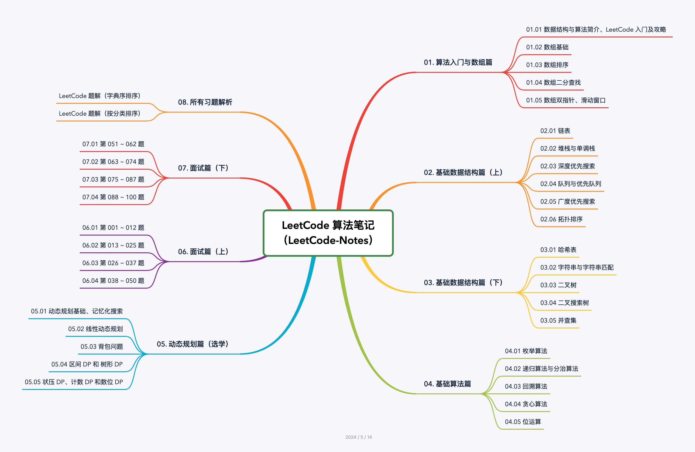

# LeetCode 算法笔记（LeetCode-Notes）

## 1. 开源初衷

在互联网行业相关的技术面试中，算法和数据结构知识往往是重点考察的内容。众多知名互联网公司喜欢在面试中考察 LeetCode 上的算法题目，通常需要面试者对给定问题进行深入分析并提供解题思路。有时候，面试官还会要求面试者评估相关算法的时间复杂度和空间复杂度。面试官通过检验面试者对常用算法的熟悉程度和实现能力的方式，从而评估面试者解决实际问题的思维能力水平。因此，对于广大面试者而言，无论是面试国内还是国外的知名互联网公司，通过刷 LeetCode 题目，深入理解算法知识，对拿到一个理想公司的优秀 Offer 都是有帮助的。

为了帮助大家，尤其是零基础或者希望全面学习算法与数据结构基础知识的同学，我们开源了 **「LeetCode 算法笔记」** 教程。该教程以基础的数据结构和算法为起点，系统讲解相关概念和知识点，再针对不同分类的数据结构和算法，从 LeetCode 平台精选出 200 多道经典算法与数据结构题目，进行具体题目的讲解分析。让学习者可以通过「算法基础理论学习」和「编程实战学习」相结合的方式，彻底掌握算法知识。

## 2. 项目简介

- 超详细的「算法与数据结构」基础讲解教程，「LeetCode 200+ 道」经典题目的详细解析。
- 本项目易于理解，没有大跨度的思维跳跃，项目中使用大量图示、例子来帮助理解。
- 本项目先从基础的数据结构和算法开始讲解，再针对不同分类的数据结构和算法，进行具体题目的讲解分析。让学习者可以通过「算法基础理论学习」和「编程实战学习」相结合的方式，彻底的掌握算法知识。
- 本项目从各大知名互联网公司面试算法题中整理汇总了「100 道高频面试题」，帮助面试者更有针对性的准备面试。

## 3. 项目地址

- 开源地址：[https://github.com/datawhalechina/leetcode-notes](https://github.com/datawhalechina/leetcode-notes)

- 在线阅读：[https://datawhalechina.github.io/leetcode-notes/](https://datawhalechina.github.io/leetcode-notes/)

- 下载 PDF：[https://github.com/datawhalechina/leetcode-notes/releases](https://github.com/datawhalechina/leetcode-notes/releases)

## 4. 使用说明

### 4.1 章节划分

1. 项目总共 8 个章节，其中第 01 ~ 05 章节为「算法与数据结构知识」，第 06 ~ 07 章节为「100 道高频面试题汇总」，第 08 章节为「所有习题解析」。
2. 项目中 的第 01 ~ 07 章节，每一章节对应「一个学习周期 / 一期组队学习安排」，对应学习时间为 14 ~ 16 天，每个学习周期 / 每期组队学习对应 42 ~ 50 道经典 LeetCode 题目。
3. 章节中每一小节对应「一个学习专题 / 一次打卡任务」，对应时间为 1 ~ 5 天。
4. 小节中每天都有对应的「学习内容」和「练习题目（每天 3 道）」。
5. 每天平均花费时间 1 ~ 3 小时不等，根据个人学习接受能力强弱有所浮动。

### 4.2 学习建议

1. 推荐先浏览项目主页的项目介绍，然后按顺序阅读 01 ~ 07 章内容。
2. 从未刷过算法题目的同学，推荐先看下 「01.01.03 LeetCode 入门及攻略（第 01 ~ 02 天）」 相关内容，对应链接为：[网页链接](https://datawhalechina.github.io/leetcode-notes/#/ch01/01.01/01.01.03-LeetCode-Guide.md)、[Github 链接](https://github.com/datawhalechina/leetcode-notes/blob/main/docs/ch01/01.01/01.01.03-LeetCode-Guide.md)。
3. 零基础或者想综合学习算法基础知识的同学，推荐按照项目中制定的学习周期进行专题学习。建议先学习 01 ~ 05 章节的算法基础知识。然后再学习 06 ~ 07 章节的面试题目。
4. 近期有面试需求的同学，推荐直接学习「06. 面试篇（上）（共 16 天）」、「07. 面试篇（下）（共 16 天）」这两期相关内容。
5. 可在看完每日的学习内容之后，选择每日对应的练习题目进行巩固练习。
6. 做完每日练习题目之后，如有余力，可通过相关专题下的题目清单进行拓展练习。

## 5. 章节目录

### 01. 算法入门与数组篇（共 14 天）：[网页链接](https://datawhalechina.github.io/leetcode-notes/#/ch01/index.md)、[Github 链接](https://github.com/datawhalechina/leetcode-notes/blob/main/docs/ch01/index.md)

| 章节标题                               | 链接地址                                                     |
| -------------------------------------- | ------------------------------------------------------------ |
| 01.01 数据结构与算法简介、LeetCode 入门及攻略（第 01 ~ 02 天） | [网页链接](https://datawhalechina.github.io/leetcode-notes/#/ch01/01.01/index)、[Github 链接](https://github.com/datawhalechina/leetcode-notes/blob/main/docs/ch01/01.01/index.md) |
| 01.02 数组基础（第 03 ~ 04 天） | [网页链接](https://datawhalechina.github.io/leetcode-notes/#/ch01/01.02/index)、[Github 链接](https://github.com/datawhalechina/leetcode-notes/blob/main/docs/ch01/01.02/index.md) |
| 01.03 数组排序（第 05 ~ 08 天） | [网页链接](https://datawhalechina.github.io/leetcode-notes/#/ch01/01.03/index)、[Github 链接](https://github.com/datawhalechina/leetcode-notes/blob/main/docs/ch01/01.03/index.md) |
| 01.04 数组二分查找（第 09 ~ 11 天） | [网页链接](https://datawhalechina.github.io/leetcode-notes/#/ch01/01.04/index)、[Github 链接](https://github.com/datawhalechina/leetcode-notes/blob/main/docs/ch01/01.04/index.md) |
| 01.05 数组双指针、滑动窗口（第 12 ~ 14 天） | [网页链接](https://datawhalechina.github.io/leetcode-notes/#/ch01/01.05/index)、[Github 链接](https://github.com/datawhalechina/leetcode-notes/blob/main/docs/ch01/01.05/index.md) |

### 02. 基础数据结构篇（上）：链表、堆栈、队列（共 15 天）：[网页链接](https://datawhalechina.github.io/leetcode-notes/#/ch02/index.md)、[Github 链接](https://github.com/datawhalechina/leetcode-notes/blob/main/docs/ch02/index.md)

| 章节标题                               | 链接地址                                                     |
| -------------------------------------- | ------------------------------------------------------------ |
| 02.01 链表（第 01 ~ 04 天） | [网页链接](https://datawhalechina.github.io/leetcode-notes/#/ch02/02.01/index)、[Github 链接](https://github.com/datawhalechina/leetcode-notes/blob/main/docs/ch02/02.01/index.md) |
| 02.02 堆栈与单调栈（第 05 ~ 07 天） | [网页链接](https://datawhalechina.github.io/leetcode-notes/#/ch02/02.02/index)、[Github 链接](https://github.com/datawhalechina/leetcode-notes/blob/main/docs/ch02/02.02/index.md) |
| 02.03 深度优先搜索（第 08 ~ 10 天） | [网页链接](https://datawhalechina.github.io/leetcode-notes/#/ch02/02.03/index)、[Github 链接](https://github.com/datawhalechina/leetcode-notes/blob/main/docs/ch02/02.03/index.md) |
| 02.04 队列与优先队列（第 11 ~ 12 天） | [网页链接](https://datawhalechina.github.io/leetcode-notes/#/ch02/02.04/index)、[Github 链接](https://github.com/datawhalechina/leetcode-notes/blob/main/docs/ch02/02.04/index.md) |
| 02.05 广度优先搜索（第 13 ~ 14 天） | [网页链接](https://datawhalechina.github.io/leetcode-notes/#/ch02/02.05/index)、[Github 链接](https://github.com/datawhalechina/leetcode-notes/blob/main/docs/ch02/02.05/index.md) |
| 02.06 拓扑排序（第 15 天） | [网页链接](https://datawhalechina.github.io/leetcode-notes/#/ch02/02.06/index)、[Github 链接](https://github.com/datawhalechina/leetcode-notes/blob/main/docs/ch02/02.06/index.md) |

### 03. 基础数据结构篇（下）：哈希表、字符串、二叉树、并查集（共 14 天）：[网页链接](https://datawhalechina.github.io/leetcode-notes/#/ch03/index.md)、[Github 链接](https://github.com/datawhalechina/leetcode-notes/blob/main/docs/ch03/index.md)

| 章节标题                               | 链接地址                                                     |
| -------------------------------------- | ------------------------------------------------------------ |
| 03.01 哈希表（第 01 ~ 02 天） | [网页链接](https://datawhalechina.github.io/leetcode-notes/#/ch03/03.01/index)、[Github 链接](https://github.com/datawhalechina/leetcode-notes/blob/main/docs/ch03/03.01/index.md) |
| 03.02 字符串与字符串匹配（ 第 03 ~ 07 天） | [网页链接](https://datawhalechina.github.io/leetcode-notes/#/ch03/03.02/index)、[Github 链接](https://github.com/datawhalechina/leetcode-notes/blob/main/docs/ch03/03.02/index.md) |
| 03.03 二叉树（第 08 ~ 10 天） | [网页链接](https://datawhalechina.github.io/leetcode-notes/#/ch03/03.03/index)、[Github 链接](https://github.com/datawhalechina/leetcode-notes/blob/main/docs/ch03/03.03/index.md) |
| 03.04 二叉搜索树（第 11 ~ 12 天） | [网页链接](https://datawhalechina.github.io/leetcode-notes/#/ch03/03.04/index)、[Github 链接](https://github.com/datawhalechina/leetcode-notes/blob/main/docs/ch03/03.04/index.md) |
| 03.05 并查集（第 13 ~ 14 天） | [网页链接](https://datawhalechina.github.io/leetcode-notes/#/ch03/03.05/index)、[Github 链接](https://github.com/datawhalechina/leetcode-notes/blob/main/docs/ch03/03.05/index.md) |

### 04. 基础算法篇：枚举、递归、分治、回溯、贪心、位运算（共 14 天）：[网页链接](https://datawhalechina.github.io/leetcode-notes/#/ch04/index.md)、[Github 链接](https://github.com/datawhalechina/leetcode-notes/blob/main/docs/ch04/index.md)

| 章节标题                               | 链接地址                                                     |
| -------------------------------------- | ------------------------------------------------------------ |
| 04.01 枚举算法（第 01 ~ 02 天） | [网页链接](https://datawhalechina.github.io/leetcode-notes/#/ch04/04.01/index)、[Github 链接](https://github.com/datawhalechina/leetcode-notes/blob/main/docs/ch04/04.01/index.md) |
| 04.02 递归算法与分治算法（第 03 ~ 06 天） | [网页链接](https://datawhalechina.github.io/leetcode-notes/#/ch04/04.02/index)、[Github 链接](https://github.com/datawhalechina/leetcode-notes/blob/main/docs/ch04/04.02/index.md) |
| 04.03 回溯算法（第 07 ~ 09 天） | [网页链接](https://datawhalechina.github.io/leetcode-notes/#/ch04/04.03/index)、[Github 链接](https://github.com/datawhalechina/leetcode-notes/blob/main/docs/ch04/04.03/index.md) |
| 04.04 贪心算法（第 10 ~ 12 天） | [网页链接](https://datawhalechina.github.io/leetcode-notes/#/ch04/04.04/index)、[Github 链接](https://github.com/datawhalechina/leetcode-notes/blob/main/docs/ch04/04.04/index.md) |
| 04.05 位运算（第 13 ~ 14 天） | [网页链接](https://datawhalechina.github.io/leetcode-notes/#/ch04/04.05/index)、[Github 链接](https://github.com/datawhalechina/leetcode-notes/blob/main/docs/ch04/04.05/index.md) |

### 05. 动态规划篇（选学）（共 15 天）：[网页链接](https://datawhalechina.github.io/leetcode-notes/#/ch05/index.md)、[Github 链接](https://github.com/datawhalechina/leetcode-notes/blob/main/docs/ch05/index.md)

| 章节标题                               | 链接地址                                                     |
| -------------------------------------- | ------------------------------------------------------------ |
| 05.01 动态规划基础、记忆化搜索（ 第 01 ~ 02 天） | [网页链接](https://datawhalechina.github.io/leetcode-notes/#/ch05/05.01/index)、[Github 链接](https://github.com/datawhalechina/leetcode-notes/blob/main/docs/ch05/05.01/index.md) |
| 05.02 线性动态规划（第 03 ~ 06 天） | [网页链接](https://datawhalechina.github.io/leetcode-notes/#/ch05/05.02/index)、[Github 链接](https://github.com/datawhalechina/leetcode-notes/blob/main/docs/ch05/05.02/index.md) |
| 05.03 背包问题（第 07 ~ 09 天） | [网页链接](https://datawhalechina.github.io/leetcode-notes/#/ch05/05.03/index)、[Github 链接](https://github.com/datawhalechina/leetcode-notes/blob/main/docs/ch05/05.03/index.md) |
| 05.04 区间 DP 和 树形 DP（第 10 ~ 12 天） | [网页链接](https://datawhalechina.github.io/leetcode-notes/#/ch05/05.04/index)、[Github 链接](https://github.com/datawhalechina/leetcode-notes/blob/main/docs/ch05/05.04/index.md) |
| 05.05  状压 DP、计数 DP 和数位 DP（第 13 ~ 15 天） | [网页链接](https://datawhalechina.github.io/leetcode-notes/#/ch05/05.05/index)、[Github 链接](https://github.com/datawhalechina/leetcode-notes/blob/main/docs/ch05/05.05/index.md) |

### 06. 面试篇（上）（共 16 天）[网页链接](https://datawhalechina.github.io/leetcode-notes/#/ch06/index.md)、[Github 链接](https://github.com/datawhalechina/leetcode-notes/blob/main/docs/ch06/index.md)

| 章节标题                               | 链接地址                                                     |
| -------------------------------------- | ------------------------------------------------------------ |
| 06.01 第 001 ~ 012 题（第 01 ~ 04 天） | [网页链接](https://datawhalechina.github.io/leetcode-notes/#/ch06/06.01/index)、[Github 链接](https://github.com/datawhalechina/leetcode-notes/blob/main/docs/ch06/06.01/index.md) |
| 06.02 第 013 ~ 025 题（第 05 ~ 08 天） | [网页链接](https://datawhalechina.github.io/leetcode-notes/#/ch06/06.02/index)、[Github 链接](https://github.com/datawhalechina/leetcode-notes/blob/main/docs/ch06/06.02/index.md) |
| 06.03 第 026 ~ 037 题（第 09 ~ 12 天） | [网页链接](https://datawhalechina.github.io/leetcode-notes/#/ch06/06.03/index)、[Github 链接](https://github.com/datawhalechina/leetcode-notes/blob/main/docs/ch06/06.03/index.md) |
| 06.04 第 038 ~ 050 题（第 13 ~ 16 天） | [网页链接](https://datawhalechina.github.io/leetcode-notes/#/ch06/06.04/index)、[Github 链接](https://github.com/datawhalechina/leetcode-notes/blob/main/docs/ch06/06.04/index.md) |

### 07. 面试篇（下）（共 16 天）：[网页链接](https://datawhalechina.github.io/leetcode-notes/#/ch07/index.md)、[Github 链接](https://github.com/datawhalechina/leetcode-notes/blob/main/docs/ch07/index.md)

| 章节标题                               | 链接地址                                                     |
| -------------------------------------- | ------------------------------------------------------------ |
| 07.01 第 051 ~ 062 题（第 01 ~ 04 天） | [网页链接](https://datawhalechina.github.io/leetcode-notes/#/ch07/07.01/index)、[Github 链接](https://github.com/datawhalechina/leetcode-notes/blob/main/docs/ch07/07.01/index.md) |
| 07.02 第 063 ~ 074 题（第 05 ~ 08 天） | [网页链接](https://datawhalechina.github.io/leetcode-notes/#/ch07/07.02/index)、[Github 链接](https://github.com/datawhalechina/leetcode-notes/blob/main/docs/ch07/07.02/index.md) |
| 07.03 第 075 ~ 087 题（第 09 ~ 12 天） | [网页链接](https://datawhalechina.github.io/leetcode-notes/#/ch07/07.03/index)、[Github 链接](https://github.com/datawhalechina/leetcode-notes/blob/main/docs/ch07/07.03/index.md) |
| 07.04 第 088 ~ 100 题（第 13 ~ 16 天） | [网页链接](https://datawhalechina.github.io/leetcode-notes/#/ch07/07.04/index)、[Github 链接](https://github.com/datawhalechina/leetcode-notes/blob/main/docs/ch07/07.04/index.md) |

### 08. 所有习题解析：[网页链接](https://datawhalechina.github.io/leetcode-notes/#/keys/index.md)、[Github 链接](https://github.com/datawhalechina/leetcode-notes/blob/main/docs/keys/index.md)

| 章节标题                               | 链接地址                                                     |
| -------------------------------------- | ------------------------------------------------------------ |
| LeetCode 题解（字典序排序） | [网页链接](https://datawhalechina.github.io/leetcode-notes/#/keys/Solutions-List)、[Github 链接](https://github.com/datawhalechina/leetcode-notes/blob/main/docs/keys/Solutions-List.md) |
| LeetCode 题解（按分类排序） | [网页链接](https://datawhalechina.github.io/leetcode-notes/#/keys/Categories-List)、[Github 链接](https://github.com/datawhalechina/leetcode-notes/blob/main/docs/keys/Categories-List.md) |

## 致谢

### 贡献者名单

| 姓名                                  | 职责                          | 简介                        | 联系          |
| :------------------------------------ | :---------------------------- | :-------------------------- | ------------- |
| [杨世超](https://github.com/itcharge) | 项目负责人，第 01~07 章节内容 | https://github.com/itcharge | i@itcharge.cn |

### 其他

1. 特别感谢 [@LSGOMYP](https://github.com/LSGOMYP)、[@Sm1les](https://github.com/Sm1les) 对本项目的帮助与支持。

## 关注我们

扫描下方二维码关注公众号：Datawhale

## LICENSE

 本作品采用 <a rel="license" href="http://creativecommons.org/licenses/by-nc-sa/4.0/">知识共享署名 - 非商业性使用 - 相同方式共享 4.0 国际许可协议</a> 进行许可。
