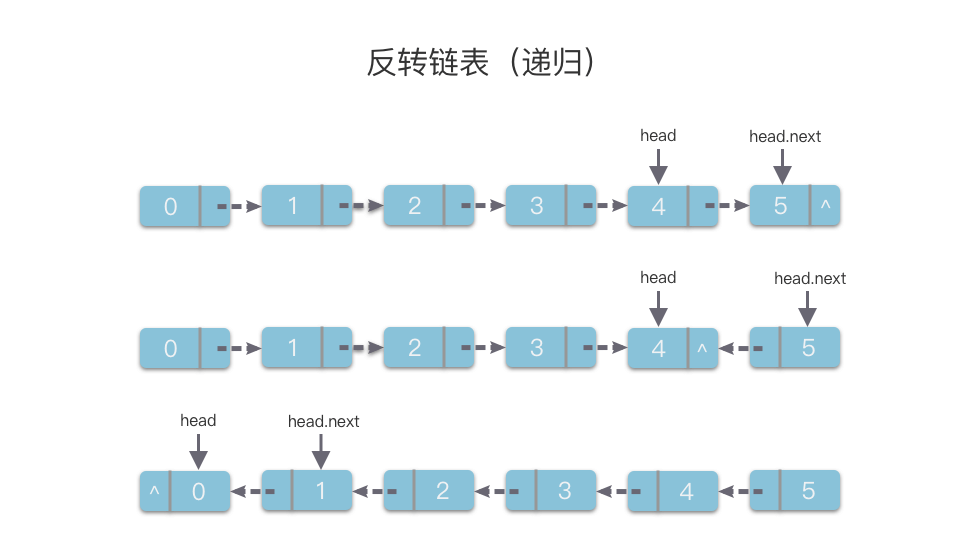

# 04.02.03 习题解析（第 04 天）

## 1. [0206. 反转链表](https://leetcode.cn/problems/reverse-linked-list/)

### 1.1 题目大意

**描述**：给定一个单链表的头节点 `head`。

**要求**：将该单链表进行反转。可以迭代或递归地反转链表。

**说明**：

- 链表中节点的数目范围是 $[0, 5000]$。
- $-5000 \le Node.val \le 5000$。

**示例**：

```python
输入：head = [1,2,3,4,5]
输出：[5,4,3,2,1]

解释
翻转前    1->2->3->4->5->NULL
反转后    5->4->3->2->1->NULL
```

### 1.2 解题思路

#### 思路 1：迭代

1. 使用两个指针 `cur` 和 `pre` 进行迭代。`pre` 指向 `cur` 前一个节点位置。初始时，`pre` 指向 `None`，`cur` 指向 `head`。

2. 将 `pre` 和 `cur` 的前后指针进行交换，指针更替顺序为：
   1. 使用 `next` 指针保存当前节点 `cur` 的后一个节点，即 `next = cur.next`；
   2. 断开当前节点 `cur` 的后一节点链接，将 `cur` 的 `next` 指针指向前一节点 `pre`，即 `cur.next = pre`；
   3. `pre` 向前移动一步，移动到 `cur` 位置，即 `pre = cur`；
   4. `cur` 向前移动一步，移动到之前 `next` 指针保存的位置，即 `cur = next`。
3. 继续执行第 2 步中的 1、2、3、4。
4. 最后等到 `cur` 遍历到链表末尾，即 `cur == None`，时，`pre` 所在位置就是反转后链表的头节点，返回新的头节点 `pre`。

使用迭代法反转链表的示意图如下所示：


#### 思路 1：代码

```python
class Solution:
    def reverseList(self, head: ListNode) -> ListNode:
        pre = None
        cur = head
        while cur != None:
            next = cur.next
            cur.next = pre
            pre = cur
            cur = next
        return pre
```

### 思路 1：复杂度分析

- **时间复杂度**：$O(n)$。
- **空间复杂度**：$O(1)$。

#### 思路 2：递归

具体做法如下：

1. 首先定义递归函数含义为：将链表反转，并返回反转后的头节点。
2. 然后从 `head.next` 的位置开始调用递归函数，即将 `head.next` 为头节点的链表进行反转，并返回该链表的头节点。
3. 递归到链表的最后一个节点，将其作为最终的头节点，即为 `new_head`。
4. 在每次递归函数返回的过程中，改变 `head` 和 `head.next` 的指向关系。也就是将 `head.next` 的`next` 指针先指向当前节点 `head`，即 `head.next.next = head `。
5. 然后让当前节点 `head` 的 `next` 指针指向 `None`，从而实现从链表尾部开始的局部反转。
6. 当递归从末尾开始顺着递归栈的退出，从而将整个链表进行反转。
7. 最后返回反转后的链表头节点 `new_head`。

使用递归法反转链表的示意图如下所示：



#### 思路 2：代码

```python
class Solution:
    def reverseList(self, head: ListNode) -> ListNode:
        if head == None or head.next == None:
            return head
        new_head = self.reverseList(head.next)
        head.next.next = head
        head.next = None
        return new_head
```

#### 思路 2：复杂度分析

- **时间复杂度**：$O(n)$
- **空间复杂度**：$O(n)$。最多需要 $n$ 层栈空间。

## 2. [0092. 反转链表 II](https://leetcode.cn/problems/reverse-linked-list-ii/)

### 2.1 题目大意

**描述**：给定单链表的头指针 `head` 和两个整数 `left` 和 `right` ，其中 `left <= right`。

**要求**：反转从位置 `left` 到位置 `right` 的链表节点，返回反转后的链表 。

**说明**：

- 链表中节点数目为 `n`。
- $1 \le n \le 500$。
- $-500 \le Node.val \le 500$。
- $1 \le left \le right \le n$。

**示例**：

- 示例 1：

```python
输入：head = [1,2,3,4,5], left = 2, right = 4
输出：[1,4,3,2,5]
```

- 示例 2：

```python
输入：head = [5], left = 1, right = 1
输出：[5]
```

### 2.2 解题思路

#### 思路 1：迭代

在「[0206. 反转链表](https://leetcode.cn/problems/reverse-linked-list/)」中我们可以通过迭代、递归两种方法将整个链表反转。而这道题要求对链表的部分区间进行反转。我们可以先遍历到需要反转的链表区间的前一个节点，然后对需要反转的链表区间进行迭代反转。最后再返回头节点即可。

但是需要注意一点，如果需要反转的区间包含了链表的第一个节点，那么我们可以事先创建一个哑节点作为链表初始位置开始遍历，这样就能避免找不到需要反转的链表区间的前一个节点。

这道题的具体解题步骤如下：

1. 先使用哑节点 `dummy_head` 构造一个指向 `head` 的指针，使得可以从 `head` 开始遍历。使用 `index` 记录当前元素的序号。
2. 我们使用一个指针 `reverse_start`，初始赋值为 `dummy_head`。然后向右逐步移动到需要反转的区间的前一个节点。
3. 然后再使用两个指针 `cur` 和 `pre` 进行迭代。`pre` 指向 `cur` 前一个节点位置，即 `pre` 指向需要反转节点的前一个节点，`cur` 指向需要反转的节点。初始时，`pre` 指向 `reverse_start`，`cur` 指向 `pre.next`。
4. 当当前节点 `cur` 不为空，且 `index` 在反转区间内时，将 `pre` 和 `cur` 的前后指针进行交换，指针更替顺序为：
   1. 使用 `next` 指针保存当前节点 `cur` 的后一个节点，即 `next = cur.next`；
   2. 断开当前节点 `cur` 的后一节点链接，将 `cur` 的 `next` 指针指向前一节点 `pre`，即 `cur.next = pre`；
   3. `pre` 向前移动一步，移动到 `cur` 位置，即 `pre = cur`；
   4. `cur` 向前移动一步，移动到之前 `next` 指针保存的位置，即 `cur = next`。
   5. 然后令 `index` 加 `1`。
5. 继续执行第 `4` 步中的 `1`、`2`、`3`、`4`、`5` 步。
6. 最后等到 `cur` 遍历到链表末尾（即 `cur == None`）或者遍历到需要反转区间的末尾时（即 `index > right`） 时，将反转区间的头尾节点分别与之前保存的需要反转的区间的前一个节点 `reverse_start` 相连，即 `reverse_start.next.next = cur`，`reverse_start.next = pre`。
7. 最后返回新的头节点 `dummy_head.next`。

#### 思路 1：代码

```python
# Definition for singly-linked list.
# class ListNode:
#     def __init__(self, val=0, next=None):
#         self.val = val
#         self.next = next
class Solution:
    def reverseBetween(self, head: ListNode, left: int, right: int) -> ListNode:
        index = 1
        dummy_head = ListNode(0)
        dummy_head.next = head
        pre = dummy_head

        reverse_start = dummy_head
        while reverse_start.next and index < left:
            reverse_start = reverse_start.next
            index += 1

        pre = reverse_start
        cur = pre.next
        while cur and index <= right:
            next = cur.next
            cur.next = pre
            pre = cur
            cur = next
            index += 1

        reverse_start.next.next = cur
        reverse_start.next = pre
        
        return dummy_head.next
```

#### 思路 1：复杂度分析

- **时间复杂度**：$O(n)$。其中 $n$ 是链表节点个数。
- **空间复杂度**：$O(1)$。

## 3. [0779. 第K个语法符号](https://leetcode.cn/problems/k-th-symbol-in-grammar/)

### 3.1 题目大意

**描述**：给定两个整数 $n$ 和 $k$。我们可以按照下面的规则来生成字符串：

- 第一行写上一个 $0$。
- 从第二行开始，每一行将上一行的 $0$ 替换成 $01$，$1$ 替换为 $10$。

**要求**：输出第 $n$ 行字符串中的第 $k$ 个字符。

**说明**：

- $1 \le n \le 30$。
- $1 \le k \le 2^{n - 1}$。

**示例**：

- 示例 1：

```python
输入: n = 2, k = 1
输出: 0
解释: 
第一行: 0 
第二行: 01
```

- 示例 2：

```python
输入: n = 4, k = 4
输出: 0
解释: 
第一行：0
第二行：01
第三行：0110
第四行：01101001
```

### 3.2 解题思路

#### 思路 1：递归算法 + 找规律

每一行都是由上一行生成的。我们可以将多行写到一起找下规律。

可以发现：第 $k$ 个数字是由上一位对应位置上的数字生成的。 

- $k$ 在奇数位时，由上一行 $(k + 1) / 2$ 位置的值生成。且与上一行 $(k + 1) / 2$ 位置的值相同；
- $k$ 在偶数位时，由上一行 $k / 2$ 位置的值生成。且与上一行 $k / 2$ 位置的值相反。

接下来就是递归求解即可。

#### 思路 1：代码

```python
class Solution:
    def kthGrammar(self, n: int, k: int) -> int:
        if n == 0:
            return 0
        if k % 2 == 1:
            return self.kthGrammar(n - 1, (k + 1) // 2)
        else:
            return abs(self.kthGrammar(n - 1, k // 2) - 1)
```

#### 思路 1：复杂度分析

- **时间复杂度**：$O(n)$。
- **空间复杂度**：$O(n)$。

## 参考资料

- 【题解】[动画图解：翻转链表的指定区间 - 反转链表 II - 力扣](https://leetcode.cn/problems/reverse-linked-list-ii/solution/dong-hua-tu-jie-fan-zhuan-lian-biao-de-z-n4px/)
- 【题解】[【宫水三叶】一个能应用所有「链表」题里的「哨兵」技巧 - 反转链表 II - 力扣](https://leetcode.cn/problems/reverse-linked-list-ii/solution/yi-ge-neng-ying-yong-suo-you-lian-biao-t-vjx6/)
